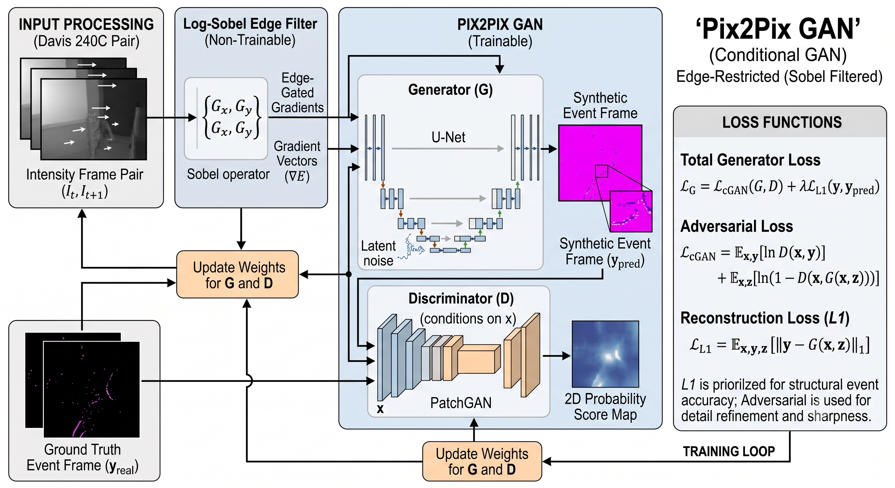
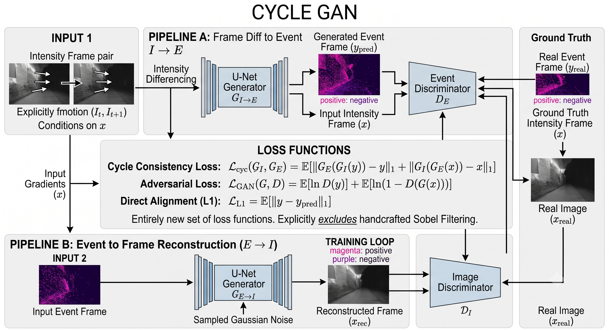
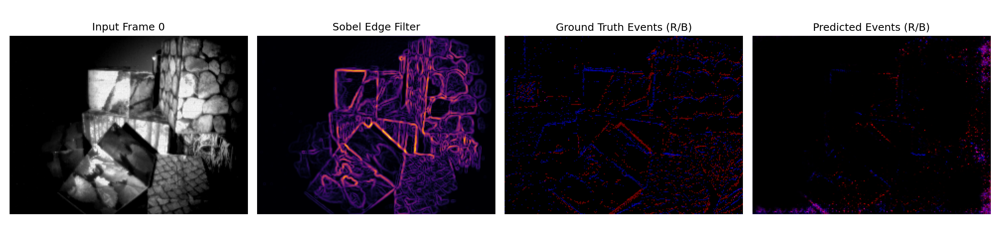
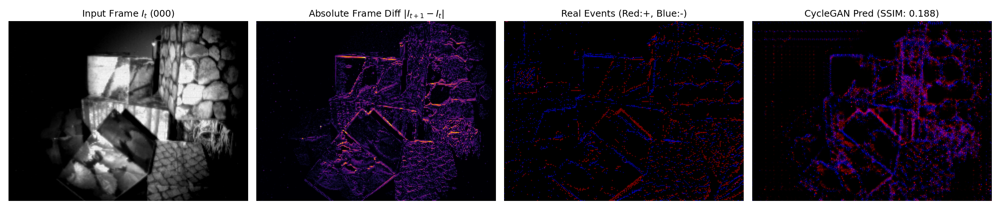

# Gen-EVENT

A deep generative framework to convert standard intensity images into high-temporal-resolution event frames for Visual Odometry (VO) and SLAM applications in robotics.

The models are trained on the **DAVIS 240C** dataset, mapping raw input images directly to accumulated ground-truth event frames using two approaches:
* **Pix2Pix:** Utilizes a Sobel edge-guided representation to learn high-contrast edge dynamics characteristic of event sensors.
* **CycleGAN:** Employs cycle-consistency loss to learn direct cross-domain translation between natural images and event frames without strict pixel-level temporal pairing.

---

## 2. Pipeline

### Pix2Pix Pipeline
The Pix2Pix architecture leverages edge guidance to synthesize event frames:



### CycleGAN Pipeline
The CycleGAN architecture performs direct cross-domain translation:



---

## 3. Installation

### a) Prerequisites
* Linux, Windows, or macOS
* Python 3.8+
* NVIDIA GPU with CUDA support (recommended)

### b) Environment Setup

```bash
# Clone the repository
git clone [https://github.com/Prateeth8/Gen-EVENT.git](https://github.com/Prateeth8/Gen-EVENT.git)
cd Gen-EVENT

# Create and activate a virtual environment
python3 -m venv venv
source venv/bin/activate       # On Windows: venv\Scripts\activate

# Install dependencies
pip install --upgrade pip
pip install -r requirements.txt
```

---

## 4. Inference

### a) Model Paths
Download the pre-trained checkpoints for Pix2Pix and CycleGAN from [Google Drive](https://drive.google.com/drive/folders/1LKY3f-buFUC05VQ--OOdooPLGfLzgMcY?usp=sharing).

To download directly on headless servers, use `gdown`:

```bash
pip install gdown
mkdir -p checkpoints
gdown --folder "[https://drive.google.com/drive/folders/1LKY3f-buFUC05VQ--OOdooPLGfLzgMcY?usp=sharing](https://drive.google.com/drive/folders/1LKY3f-buFUC05VQ--OOdooPLGfLzgMcY?usp=sharing)" -O checkpoints/
```

### b) Inference Script
Run inference on an image sequence to generate event frames:

```bash
python3 inference.py \
  --model_type pix2pix \
  --model_path checkpoints/pix2pix_best.pth \
  --data_path data/sample_frames/ \
  --out_path outputs/pix2pix_results/
```

#### Argument Details
| Argument | Description | Example / Default |
| :--- | :--- | :--- |
| `--model_type` | Architecture selection (`pix2pix` or `cyclegan`) | `pix2pix` |
| `--model_path` | Path to the trained checkpoint (`.pth`) | `checkpoints/pix2pix_best.pth` |
| `--data_path` | Path to directory containing input images | `data/sample_frames/` |
| `--out_path` | Output directory where event frames will be saved | `outputs/` |

---

## 5. Benchmark Results

### a) Metrics
Quantitative evaluation on the *boxes_rotation* sequence comparing synthesized frames against ground truth event representations:

| Model | MAE ↓ | RMSE ↓ | SSIM ↑ |
| :--- | :---: | :---: | :---: |
| **Pix2Pix** | **0.16525** | 0.24280 | **0.20332** |
| **CycleGAN** | 0.17476 | **0.24233** | 0.17720 |

### b) Plots of Prediction

| Pix2Pix Prediction | CycleGAN Prediction |
| :---: | :---: |
|  |  |

---

## 6. Citation

If you use this repository or model weights in your research, please cite:

@software{rao_genevent_2026,
  author  = {Prateeth Rao},
  title   = {Gen-EVENT},
  year    = {2026},
  url     = {https://github.com/Prateeth8/Gen-EVENT},
  version = {1.0.0}
}


---

## 7. License

Distributed under the [MIT License](LICENSE).